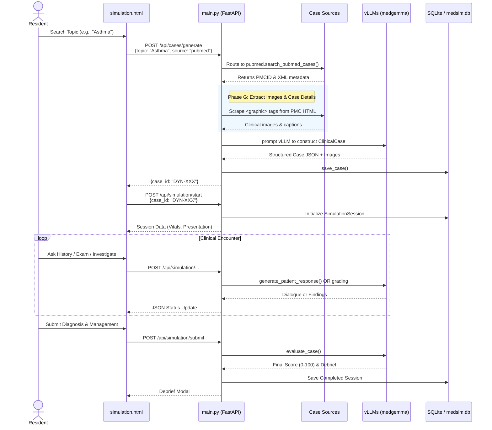

# MedSimulation 🩺

An AI-powered clinical simulation engine designed for resident training, medical student education, and diagnostic competency assessment.

MedSimulation provides a dynamic, simulated clinical environment where learners can interact with AI "patients," review multi-modal diagnostics (including live ECGs and full DICOM imaging stacks), and receive detailed, structured feedback on their clinical reasoning.

## 🚀 Key Features

### 🧠 Advanced AI Backend (vLLM)
- **Local & Cloud Inference:** Run open-weights medical LLMs (e.g., `medgemma-4b-it` or `medgemma-27b-it`) locally via `vLLM` on consumer GPUs, or connect to cloud API endpoints seamlessly.
- **Simulated Mode:** Instantly boot the server without an AI backend using deterministic, rule-based fallback scoring.
- **Patient Persona Engine:** AI dynamically impersonates the patient during history taking, delivering realistic dialogue and withholding key information until asked the right questions.
- **Automated Grading:** A built-in "senior clinician" agent scores the resident out of 100 based on 5 domains: History, Physical Exam, Investigations, Diagnosis, and Management.

### 📚 Dynamic Case Pipeline
Never run out of cases to practice. MedSimulation features a robust ingestion pipeline backing onto a SQLite database with an administrative review queue:
- **PubMed Integration:** Fetches and parses clinical case xml from NCBI databases.
- **Wiley Clinical Case Reports:** Imports real-world open-access case reports.
- **EndlessMedical API:** Integrates programmatic diagnostic challenges.
- **AgentClinic Format:** Imports pre-structured AI multi-agent medical evaluation benchmarks.
- **Free-text AI Generation:** Generates bespoke clinical cases from a single symptom or scenario prompt.

### 🖼️ Generative Patient Media
- **Photorealistic Portraits**: DALL-E 3 generates highly realistic patient portraits matching the clinical presentation upon case creation. Viewable in the Physical Exam tab.
- **Conversational Text-to-Speech**: Integrated OpenAI TTS-1 automatically voices the patient's dialogue out loud during history taking, adapting the voice (`alloy` or `nova`) based on the patient's demographics.

### 🧠 Adaptive Learning & Engagement
- **Contextual Bandits**: A lightweight Thompson Sampling engine (`bandits.py`) runs natively in the backend. 
- **Dynamic Curriculum**: Instead of random case presentation, the dashboard intelligently samples from Beta distributions mapped to `[specialty]_[difficulty]` arms, recommending the exact case prototypes proven to maximize user engagement.
- **Real-Time Telemetry**: Every time a resident clicks "Start Simulation," the frontend silently fires a telemetry event that instantly updates the Bandit's reward matrix.

### 📷 Advanced Medical Imaging
- **Interactive Image Viewer:** High-definition Lightbox Viewer for X-rays and Ultrasound imagery, providing zoom, pan, and contrast adjustment controls.
- **Programmatic ECGs:** An onboard SVG generator algorithmically draws realistic 12-lead ECG strips complete with 1mm grid paper. Renders morphological variants like STEMI, left bundle branch blocks, atrial fibrillation, and peaked T-waves on the fly without relying on static files.
- **DICOM & Cornerstone3D:** Full `pydicom` support for unpacking raw `.dcm` dataset ZIP files. Automatically detects multi-slice stacks (CT/MRI) and patient metadata to scaffold simulation structures. The frontend integrates `Cornerstone` to provide an authentic radiologist toolkit, enabling:
  - Scroll-wheel navigation through rapid sequence stacks.
  - Native Window Width & Window Center adjustment by dragging to reveal hidden soft tissue vs. bone pathology on Hounsfield unit-configured screens.
  - Direct revelation of the "ground truth" radiologic interpretation overlay mapped to the image.

---

## 🏗️ Architecture & API Flow

The diagram below illustrates the comprehensive lifecycle of a Resident interacting with the system, highlighting the unified case generation pipeline:



---

## 🛠️ Tech Stack & Setup

**Backend**:
- `Python 3.11+`
- `FastAPI` + `Uvicorn`
- `vLLM` + `OpenAI` client
- `SQLite3` (native)
- `pydicom` for radiology volumes

**Frontend**:
- Vanilla HTML, CSS, JavaScript (No heavy framework, instant loading)
- `Jinja2` templating
- `Cornerstone Core/Tools/WADO` for DICOM rendering (via CDN)

### Installation

1. Clone the repository and install dependencies using `uv`:
   ```bash
   # Install core dependencies
   uv sync
   
   # Optional: If you intend to run vLLM locally on a GPU
   uv sync --extra gpu
   ```

2. Copy the config template and edit `.env`:
   ```bash
   cp .env.example .env
   # Update VLLM_MODE to 'simulated', 'local', or 'cloud'
   ```

3. Run the application:
   ```bash
   # If running locally with an LLM, start the vLLM server first:
   bash scripts/start_vllm.sh
   
   # Start the FastAPI engine:
   uv run python main.py
   ```

4. Navigate your browser to `http://localhost:8000`.

---

## 🏥 Simulation Domains

MedSimulation tracks and evaluates five critical domains during an encounter:

1. **History Taking:** The resident interviews an AI patient via text. The AI responds realistically based on its background context.
2. **Physical Exam:** Residents select high-yield organ systems to inspect, receiving direct textual findings without hallucination (ensuring clinical safety).
3. **Investigations & Imaging:** Residents order blood work or radiologic procedures. *Cost and relevance are factored into their final score.*
   - If imaging is available (X-ray, CT, ECG), residents can interact with the actual image via the built-in Lightbox or DICOM viewer.
4. **Diagnosis:** Generating a structured differential list and arriving at a conclusive primary diagnosis.
5. **Management:** Synthesizing an acute and long-term care plan based on guidelines.

## 📁 Repository Structure

```text
MedSimulation/
├── main.py                     # FastAPI routes & static mounts
├── pyproject.toml              # Build config & Dependencies
├── .env.example                # Deployment environment keys/modes
├── data/
│   ├── medsim.db               # Auto-generated SQLite database
│   └── imaging/                # DICOM storage, SVGs, static assets
├── scripts/
│   └── start_vllm.sh           # GPU spinup local shell script
├── src/simulation/
│   ├── cases.py                # Schema & base definitions
│   ├── chat_chain.py           # Persona dialogue engine
│   ├── database.py             # SQLite ORM wrapper
│   ├── debrief.py              # Narrative feedback extraction
│   ├── imaging.py              # ECG generation & serving logic
│   ├── scorer.py               # AI & Rule-based assessment matrices
│   ├── simulator.py            # Simulation state lifecycle logic
│   ├── vllm_client.py          # Unified Local/Cloud adapter
│   └── case_sources/
│       ├── ai_generator.py     # Prompt-to-case factory
│       ├── dicom_import.py     # DICOM ZIP parser to ClinicalCase
│       ├── endless_medical.py  # Diagnostic API bridging
│       ├── pubmed.py           # NCBI E-utilities extraction
│       └── wiley.py            # Clinical Case Reports (OAI-PMH)
├── templates/
│   └── simulation.html         # Cornerstone DOM, interface, logic
└── tests/                      # Pytest suite
```

## 📜 Future Roadmap
- FHIR (Fast Healthcare Interoperability Resources) data structures mapping.
- Native EHR (Electronic Health Record) dashboard UI skinning.
- Audio transcriptions (whisper) for hands-free simulation.

## 🗒️ Known Limitations / TODO

### UX & Clinical Realism
- **Lab/Imaging results for newly ordered tests**: When a resident orders a test not pre-loaded in the case (e.g. selecting a CBC mid-simulation), the UI currently returns "no result available." The system should dynamically generate plausible, case-consistent results for any ordered test rather than surfacing a dead-end.
- **Speech-to-text input for doctors**: Typing is not natural for clinicians during a simulated encounter. Integrate Whisper (local) or OpenAI Whisper API so residents can speak their questions/orders and have them transcribed into the input field. This is especially important for hands-free workflow and realism.
- **Text-to-speech for patient responses**: Displaying the patient's reply as readable text lets residents re-read it indefinitely, which is unrealistic. Convert patient dialogue to audio (OpenAI TTS-1 or equivalent) so the resident must listen attentively — mirroring a real clinical encounter. Text display should be suppressed or delayed.

### Scoring & Quality Metrics
- **Patient satisfaction score**: Track and penalise repetitive or unnecessary questions during history taking. Frequent redundant queries lower the simulated patient's satisfaction score — surfaced in the debrief as a proxy for bedside manner and efficiency. This score directly affects the hospital's simulated quality metrics.
- **Hospital-specific satisfaction metrics**: At scale, different institutions have different quality frameworks (e.g. HCAHPS, CQC, internal KPIs). The scoring engine should support per-hospital configuration that maps satisfaction dimensions to institution-specific weights. Store these profiles in the database so results are comparable within, not just across, institutions.

### Documentation & Review
- **Full session transcript export**: Every simulation session (history taking dialogue, exam choices, ordered investigations, differential, management plan, AI scores, and debrief) should be exportable as a structured document (PDF or structured JSON). This enables review by supervising consultants or subject-matter experts without having to replay the simulation.

### Infrastructure (Context Window)
- **Context sliding for patient conversation**: medgemma-4b-it has a 4096-token context window. Long simulations (>25 exchanges) will eventually hit the limit. Implement a sliding-window trim in `chat_chain.py` — keep system prompt + last N turn pairs, dropping older history at inference time while preserving it in memory for scoring/debrief.
- **vLLM context length**: Default `VLLM_MAX_MODEL_LEN=4096`. For better case generation quality, restart with `VLLM_MAX_MODEL_LEN=8192 bash scripts/start_vllm.sh`.
- **Session Checkpoint Agent**: Background agent that periodically persists in-progress sessions to SQLite. `save_session()` already exists in `database.py` but is never called — a server restart currently drops all active sessions.

## 🤖 TODO - Agentic Workflow

### High Impact

- **Clinical Reasoning Agent**: Mid-simulation agent that monitors the action log in real-time, detects missed critical tests, prompts the resident with Socratic questions (e.g. *"You've ordered an ECG — what are you ruling out?"*), and maintains a running differential updated after each action. Tools: `get_session_state`, `update_differential`, `flag_critical_miss`.

- **Case Quality Verification Agent**: Post-generation agent loop that validates clinical plausibility (drug doses, lab values, vital signs), cross-references the diagnosis against the investigations provided, and retries generation with corrected prompts if quality checks fail. Fixes the biggest current gap — AI-generated cases have no validation pass.

- **Personalized Curriculum Agent**: Per-resident agent that tracks performance across sessions, builds a weakness profile (e.g. consistently misses sepsis workup), and generates targeted cases for weak domains. Tools: `read_session_history`, `update_resident_profile`, `recommend_next_case`. Requires session persistence to be enabled first.

### Medium Impact

- **Socratic Debrief Agent**: Replaces the one-shot debrief text with a conversational agent that asks follow-up questions about the resident's reasoning, waits for their explanation, and iterates through missed reasoning steps via dialogue — closer to real clinical teaching.

- **Differential Diagnosis Agent**: Runs alongside the resident throughout the simulation, maintaining a Bayesian-style differential updated after each history question and investigation. At submission, compares the resident's diagnosis to the agent's top differential and highlights where reasoning diverged. Tools: `update_differential`, `compute_pretest_probability`, `compare_to_resident`.

- **EndlessMedical Iterative Feature Agent**: Replaces the current zero-feature API call (which returns useless generic priors) with an agent that extracts relevant clinical features from the case topic, iteratively calls `AddEvidence` to narrow the differential, and feeds the refined differential back into case generation for a more realistic presentation.

### Lower Lift

- **Multi-Agent Scoring Panel**: Runs 3 specialist agents in parallel instead of a single senior clinician call — a Clinician agent (medical accuracy), a Teacher agent (reasoning order: history before exam before diagnosis), and a Patient Safety agent (flags dangerous omissions such as missed sepsis workup or delayed imaging). Scores are aggregated for the final result.

## License
MIT License
